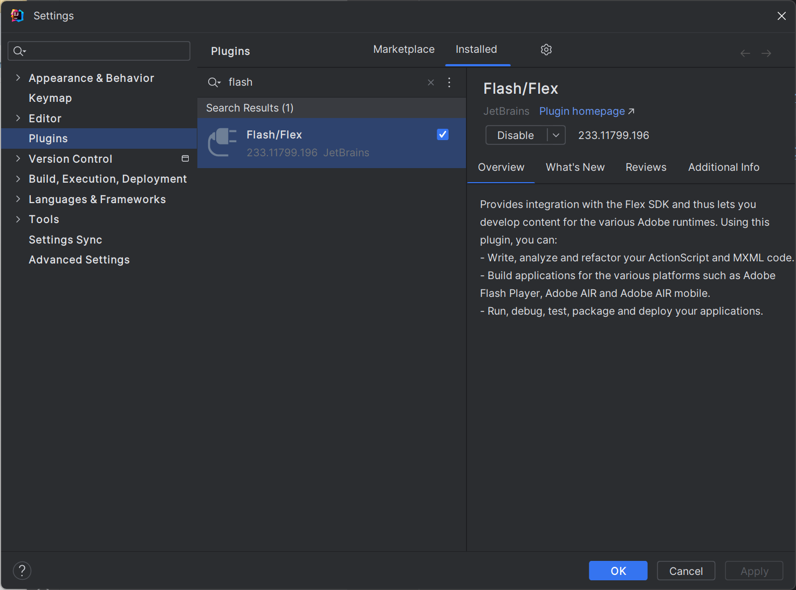
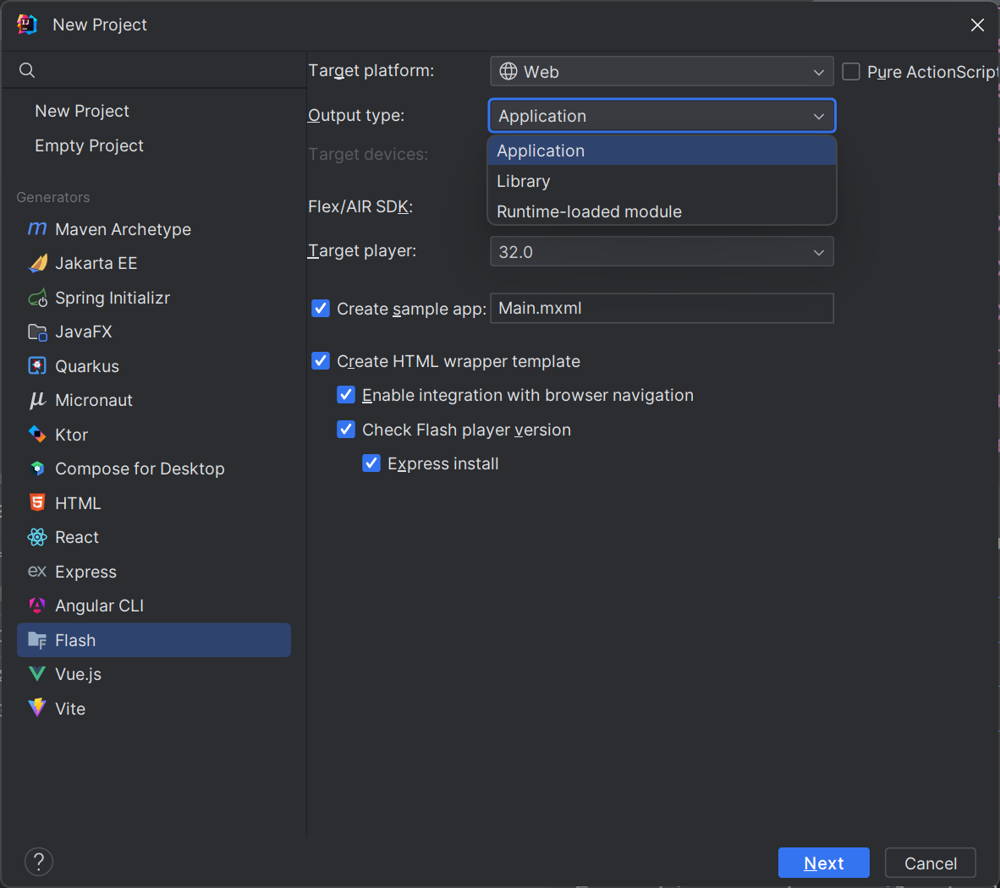
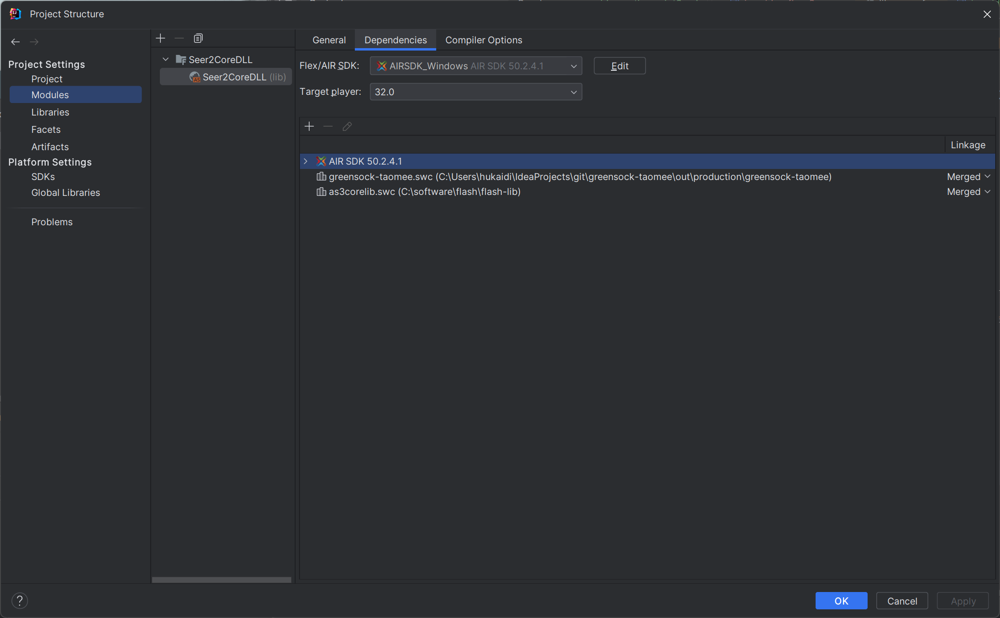
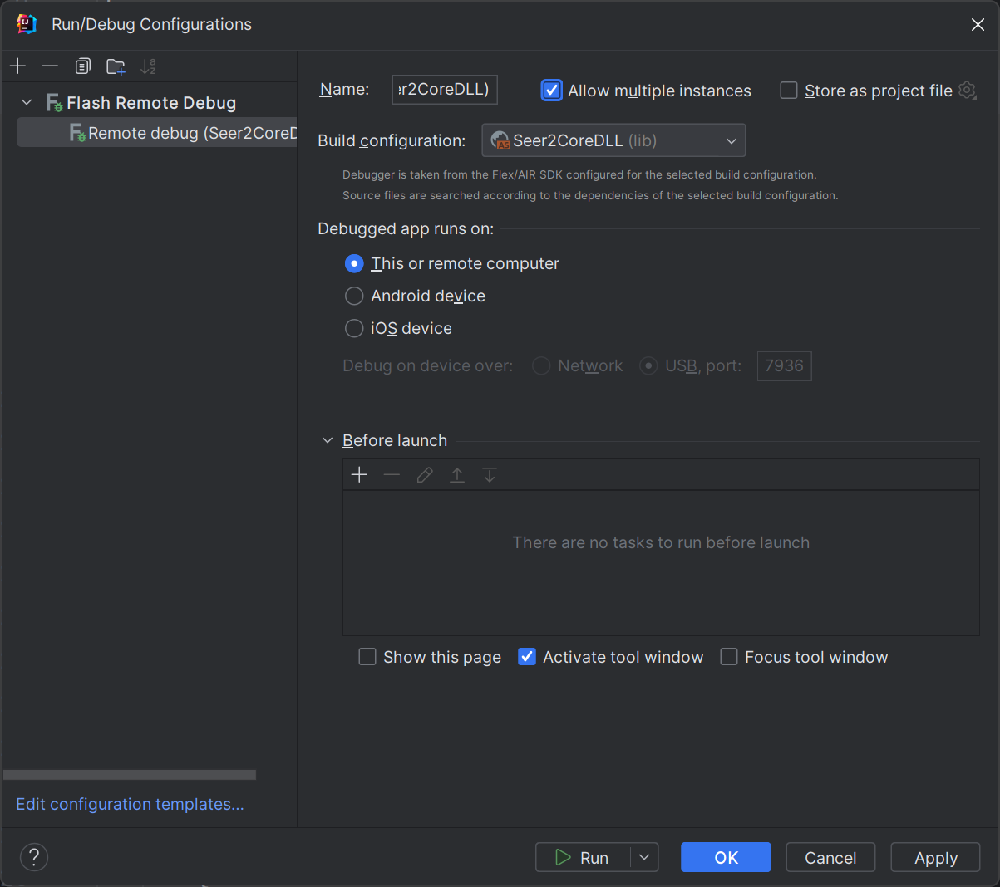
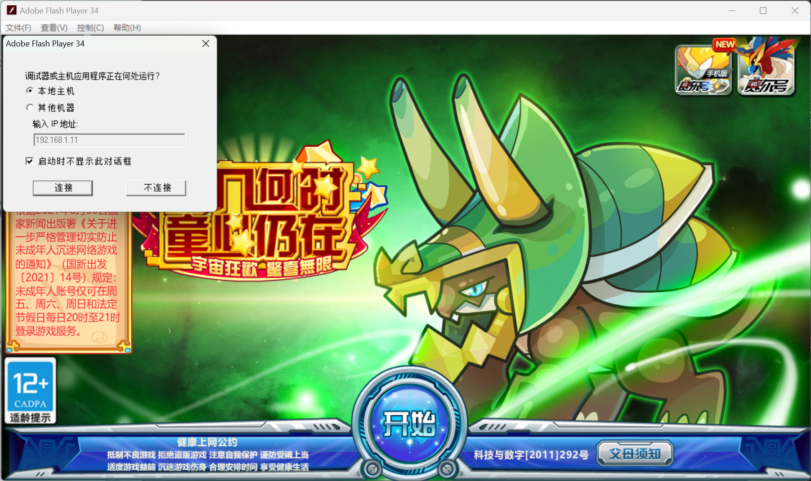

# 如何使用idea开发flash项目

## 环境配置

1. airsdk https://airsdk.harman.com/download

   一共是两个sdk，AIRSDK_Windows 和 AIRSDK_Flex_Windows，建议两个都下载下来

2. flex https://flex.apache.org/download-binaries.html

   各个平台都有，Windows下载apache-flex-sdk-4.16.1-bin.zip 即可

3. idea https://www.jetbrains.com/zh-cn/idea/

   建议使用专业版，下载完成后安装 flash 插件，这样 idea 才能识别出 AS 代码
   

   插件安装后，还需要导入 sdk，需要注意导入 AIRSDK_Windows 时只需要保留 playerglobal.swc 即可
   

## 快速上手

新建项目时有两个地方需要关注：

output type:
- Application, 一个独立的 swf 文件，可以直接启动
- Library, 一个 swc 格式的类库，实际上是个压缩包，里面还有一个编译后的 swf 文件，可以动态载入到 flash 程序中
- Runtime-loaded Module, 一个运行时加载的 swf 文件，通常和 Application 配合使用

Flex/AIR SDK:
- AIRSDK_Windows, 通常选这个
- AIRSDK_Flex_Windows, 一般用不到
- apache-flex-sdk-4.16.1-bin, 一般也用不到

## 使用类库

flash的类库通常都是 swc 格式，导入也分为几种模式，常见的包括
- Merged, 合并文件，生成的 swf、swc 文件中会包含依赖的类库文件
- External, 排除文件，生成的 swf、swc 文件中不会包含类库文件

如何选择？

如果只有一个独立 swf 文件，建议选择 Merged，这样程序可以直接启动

如果是一个复杂的多swf文件，且涉及到动态加载模块，建议 module 公共的类库使用 Merged，module 独有的类库使用 External

## 如何调试

idea 支持调试 flash

首先需要在新建一个调试项，可参考截图配置

然后需要使用 debug 版本的 flash player，右键连接本地调试器

连接成功后，会显示类似的提示文案，需要注意的是调试连接不是很稳定，连接失败了可以多试几次

## 其他问题

记录一下可能会遇到的问题

1. java.lang.NoClassDefFoundError: flex2/tools/VersionInfo

   项目的 Flex/AIR SDK 选择的有问题，检查下是否为 AIRSDK_Windows

2. VerifyError: Error #1079: 载入代码中不允许使用内置方法

   检查下类库是否配置正确，playerglobal.swc 必须为 External。[link](https://sharecoding.wordpress.com/2012/09/05/flash-error-1079-and-1065/)

3. 部分代码缺少高亮，文件缺失

   根据缺失类的全路径判断应该导入什么样的类库

   flash.*, flashx.* 通常可以通过导入 apache-flex-sdk-4.16.1-bin 中的类库解决

   com.* 可以去谷歌搜索别人打包好的 swc 文件尝试

4. flash.display::MovieClip@24c8b431 转换为 fl.text.TCMText
   layout 版本问题，可以使用 v227 版本。[link](https://community.adobe.com/t5/flex-discussions/updating-tlf-swc-to-2-0-in-flash-cs4/m-p/2924516)

## End

